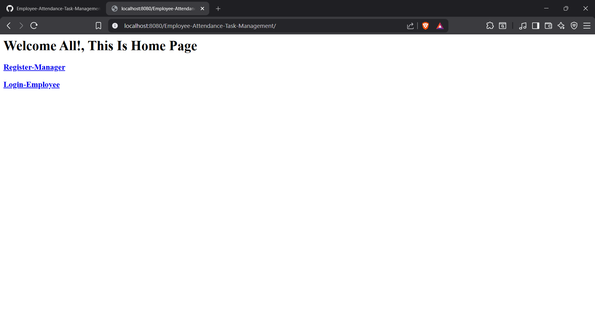
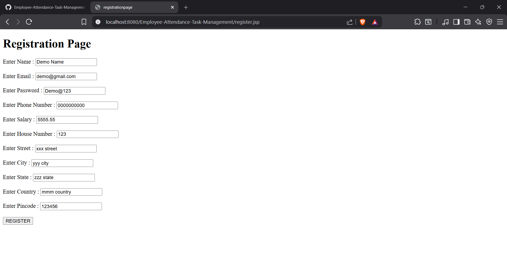
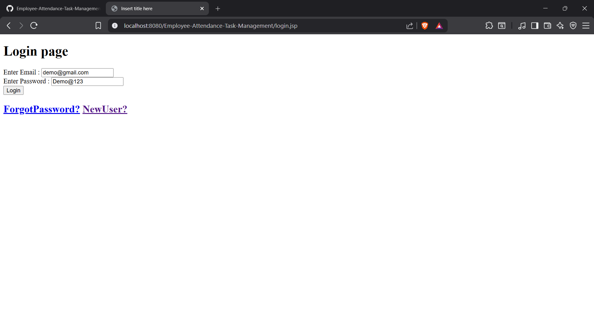
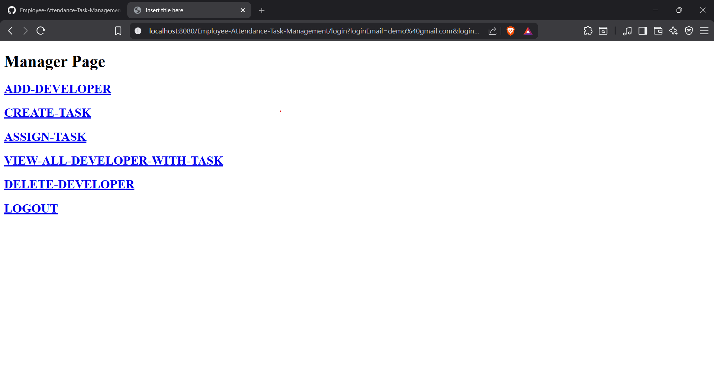
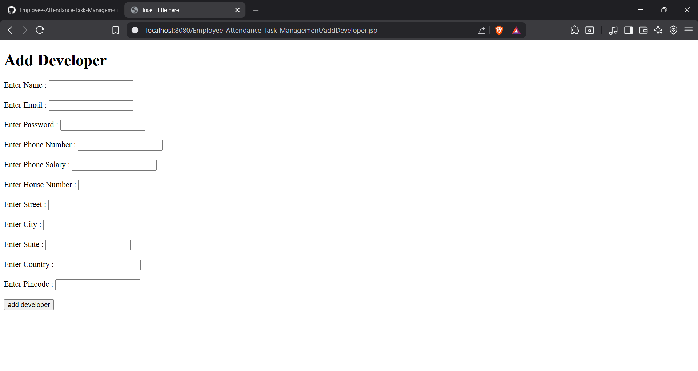
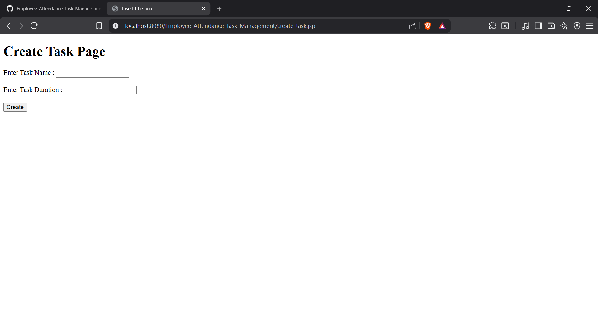
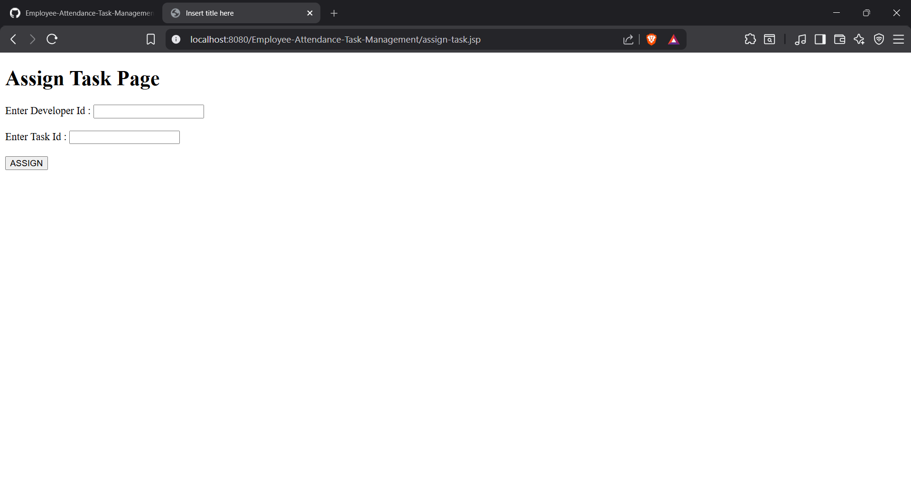
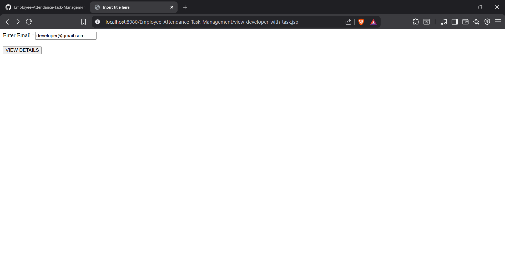
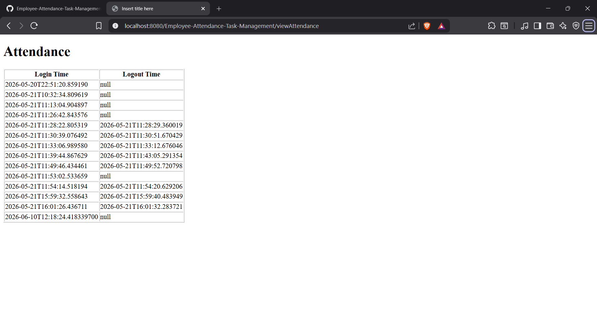
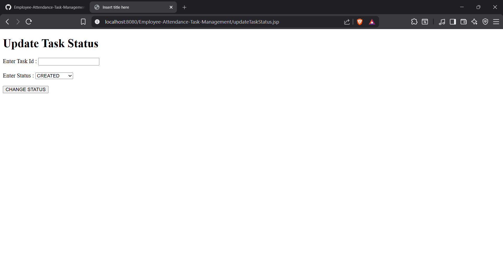

# Employee Attendance & Task Management System

## 🚀 Project Overview

Employee Attendance & Task Management System is a web-based application developed using Java, Spring MVC, Hibernate, JSP, and MySQL. The system helps organizations manage employees, track attendance, assign tasks, monitor task progress, and maintain employee records efficiently.

The application supports role-based access where Managers can manage developers and tasks, while Developers can view assigned tasks, update task status, and track attendance history.

---

## 🎯 Project Objectives

* Automate employee management processes
* Track employee attendance
* Manage task assignment and monitoring
* Reduce manual record maintenance
* Implement role-based access control
* Demonstrate enterprise application development concepts

---

## ✨ Features

### Manager Module

* Register Manager
* Add Developer
* Create Tasks
* Assign Tasks
* View Developer Details
* Monitor Assigned Tasks
* Delete Developer
* Logout

### Developer Module

* Login
* View Assigned Tasks
* Update Task Status
* View Attendance History
* Logout

### Attendance Management

* Automatic Login Time Recording
* Automatic Logout Time Recording
* Attendance History Tracking

### Authentication

* Employee Login
* Session Management
* Forgot Password
* Password Reset

---

## 🛠️ Technology Stack

### Backend

* Java
* Spring MVC
* Hibernate ORM
* JPA

### Frontend

* JSP
* HTML
* CSS

### Database

* MySQL

### Build Tool

* Maven

### Utilities

* ModelMapper
* Lombok

---

## 🏗️ Architecture

The application follows MVC Architecture:

Controller Layer
↓
Service Layer
↓
DAO Layer
↓
Database Layer

### Controller Layer

Handles incoming HTTP requests.

### Service Layer

Contains business logic and validations.

### DAO Layer

Handles database operations using Hibernate.

### Database Layer

Stores employee, attendance, address, and task information.

---

## 🗄️ Database Design

### Employee

* Employee ID
* Employee Name
* Email
* Password
* Phone Number
* Salary
* Role

### Address

* Address ID
* House Number
* Street
* City
* State
* Country
* Pincode

### Task

* Task ID
* Task Name
* Duration
* Status

### Attendance

* Attendance ID
* Login Time
* Logout Time

---

## 🔗 Entity Relationships

### Employee ↔ Address

One-To-One Relationship

### Employee ↔ Task

One-To-Many Relationship

### Employee ↔ Attendance

One-To-Many Relationship

---

## 🔄 Application Workflow

### Manager Workflow

Register Manager
↓
Login
↓
Add Developers
↓
Create Tasks
↓
Assign Tasks
↓
Monitor Developers
↓
Logout

### Developer Workflow

Login
↓
View Assigned Tasks
↓
Update Task Status
↓
View Attendance
↓
Logout

---

## 📸 Screenshots

### Home Page

### Registration Page

### Login Page

### Manager Dashboard

### Add Developer

### Create Task

### Assign Task

### View Developer Details

### Attendance History

### Update Task Status

---

## 🎓 Concepts Learned

Through this project, I gained hands-on experience in:

* Core Java
* OOP Concepts
* Collections Framework
* Exception Handling
* JDBC Concepts
* SQL
* MySQL
* Hibernate ORM
* Spring MVC
* MVC Architecture
* DAO Pattern
* DTO Pattern
* Session Management
* Authentication
* Attendance Tracking
* Task Lifecycle Management
* Entity Relationships
* ModelMapper

---

## 🔮 Future Enhancements

* Spring Boot Migration
* Spring Security
* JWT Authentication
* Role-Based Authorization
* Email Verification
* Pagination and Sorting
* REST API Development
* React Frontend Integration
* Docker Deployment
* Cloud Deployment

---

## 👨‍💻 Developer

**Gunaseelan Murugesan**

Java Full Stack Developer

📧 [gunaseelan05221@gmail.com](mailto:gunaseelan05221@gmail.com)

📱 7418708712

📍 Dindigul, Tamil Nadu, India
